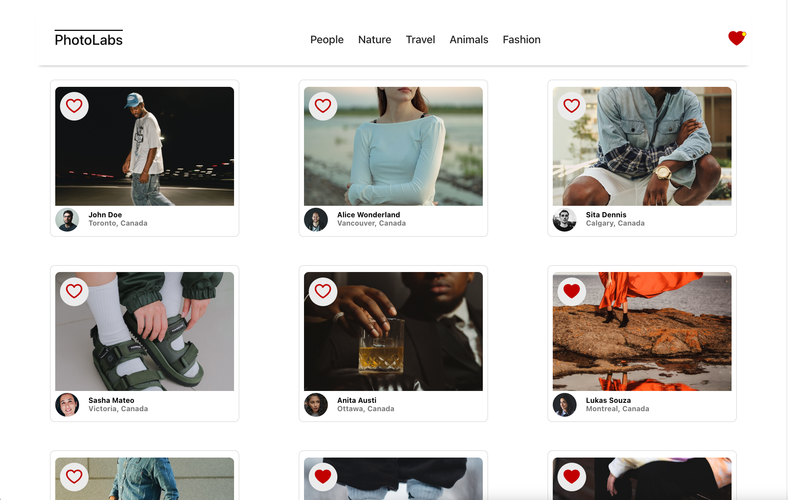
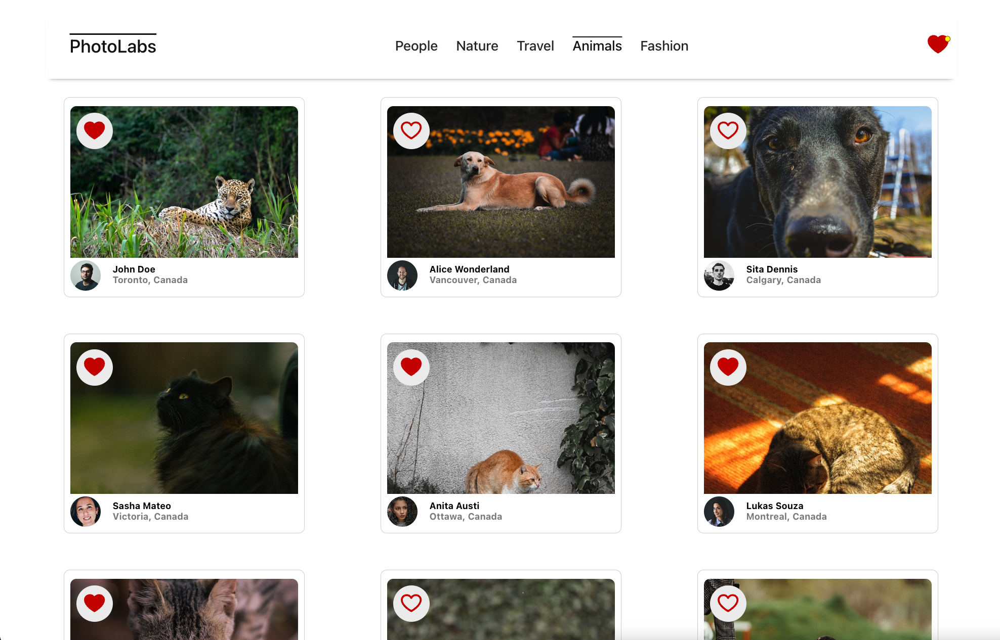
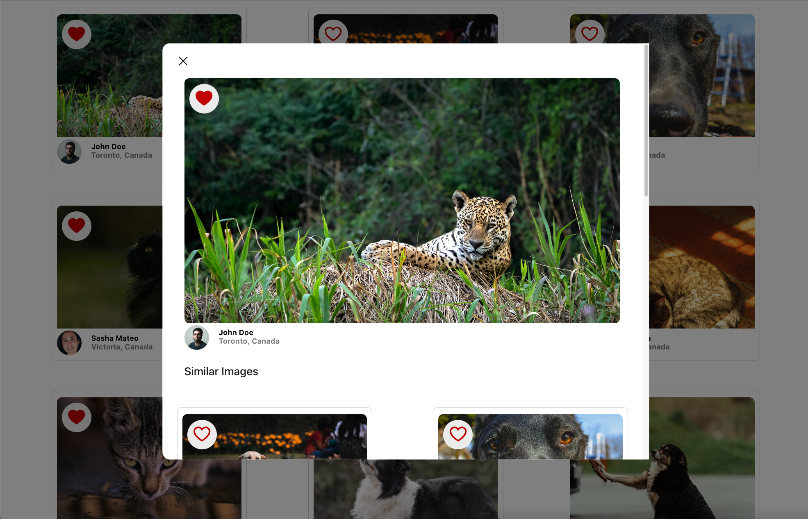
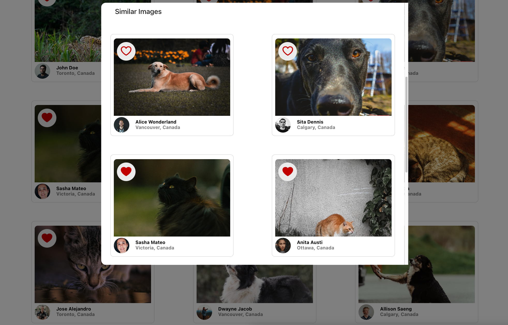

# react-photolabs

PhotoLabs is a full-stack webapp created using PostGreSQL, ExpressJs, ReactJs, and NodeJs. It is project #7 as part of my learnings at [Lighthouse Labs' Web Development Bootcamp.](https://www.lighthouselabs.ca/en/web-development)

Given existing server architecture and style code, I was tasked with creating, populating, updating and styling components using recently learned methods including:

- a custom hook,
- useEffect and useReducer for state management,
- prop drilling
- object manipulation (map, filter, includes, some)
- API and json use
- and more.

# Photolabs

Users are able to view photos, obtained via API, on the home page. From here, a user can navigate to various photo topics to filter the view or click a photo to view a larger version of it along with similar photos. A user can favorite photos from anywhere in the application.

## Setup

Clone the repo.

Install dependencies with `npm install` in each respective `/frontend` and `/backend`.

```sh
cd frontend
npm install
```

```sh
cd backend
npm install
```


## [Frontend] Running Webpack Development Server

```sh
cd frontend
npm start
```

## [Backend] Running Backend Servier

Read `backend/readme` for further setup details.

```sh
cd backend
npm start
```

## Gallery

### Main View

### Filter Photos by Topic

### View Photo Details

### View Similar Photos
